# Deploying to the Cloud with Terraform and GitHub Actions - The GitOps way!

In this challenge, you will create a [Continuous Integration/Continuous Delivery](https://www.atlassian.com/continuous-delivery/principles/continuous-integration-vs-delivery-vs-deployment) pipeline using GitHub Actions, Terraform OSS and a couple of other [OSS](https://en.wikipedia.org/wiki/Open-source_software) tools to validate Terraform template specifications and to ensure InfoSec best practices. We’ll be using [GitOps](https://about.gitlab.com/topics/gitops/) to achieve this!

# Table of Contents

- [Tools and Tech](#tools-and-tech)
- [How the Challenge is Structured](#how-the-challenge-is-structured)
- [Problem Statement](#problem-statement)
- [Architecture](#architecture)
- [Pre-Reqs](#pre-reqs)
  * [Service Providers](#service-providers)
    + [GitHub](#github)
    + [Terraform Cloud](#terraform-cloud)
    + [Amazon Web Services (AWS)](#amazon-web-services-aws)
      - [Accessing your Cloud9 Environment](#accessing-your-cloud9-environment)
      - [Disable Temporary Credentials (Required)](#disable-temporary-credentials-required)
      - [Enable Auto-Save (optional)](#enable-auto-save-optional)
  * [Install Terraform and jq](#install-terraform-and-jq)
  * [Get the Code Templates](#get-the-code-templates)
- [Building the Solution](#building-the-solution)
  * [Repository for your code (Stage 1)](#repository-for-your-code-stage-1)
    + [Prepare files](#prepare-files)
    + [Create repository](#create-repository)
    + [For Discussion](#for-discussion)
    + [Definition of Done](#definition-of-done)
  * [Workspace for Terraform (Stage 2)](#workspace-for-terraform-stage-2)
    + [Prepare files](#prepare-files-1)
    + [Create workspace](#create-workspace)
    + [For Discussion](#for-discussion-1)
    + [Definition of Done](#definition-of-done-1)
  * [Create Terraform Configuration (Stage 3)](#create-terraform-configuration-stage-3)
    + [main.tf file](#maintf-file)
    + [variables.tf file](#variablestf-file)
    + [terraform.auto.tfvars file](#terraformautotfvars-file)
    + [outputs.tf file](#outputstf-file)
    + [For Discussion](#for-discussion-2)
    + [Definition of Done](#definition-of-done-2)
  * [Create Actions Workflow (Stage 4)](#create-actions-workflow-stage-4)
    + [Git Checkout Step](#git-checkout-step)
    + [Setup Terraform Step](#setup-terraform-step)
    + [Set up Terraform Init and Format Steps](#set-up-terraform-init-and-format-steps)
    + [For Discussion](#for-discussion-3)
    + [Definition of Done](#definition-of-done-3)
  * [Terraform Plan and Apply (Stage 5)](#terraform-plan-and-apply-stage-5)
    + [Terraform Plan Step](#terraform-plan-step)
    + [Terraform Apply Step](#terraform-apply-step)
    + [First Pull Request](#first-pull-request)
    + [For Discussion](#for-discussion-4)
    + [Definition of Done](#definition-of-done-4)
  * [Security IN the Pipeline (Stage 6)](#security-in-the-pipeline-stage-6)
    + [Definition of Done](#definition-of-done-5)
  * [Cleanup (Stage 7)](#cleanup-stage-7)
    + [Destroy infrastructure](#destroy-infrastructure)
    + [Delete Workspace](#delete-workspace)
  * [OPTIONAL BONUS STAGE](#optional-bonus-stage)
    + [Plan Outputs to Comments (Part 1)](#plan-outputs-to-comments-part-1)
    + [Definition of Done](#definition-of-done-6)
    + [Putting it all together (Part 2)](#putting-it-all-together-part-2)
    + [For Discussion](#for-discussion-5)
    + [Definition of Done](#definition-of-done-7)
- [Conclusion](#conclusion)

# Tools and Tech

Here's a list of tools and techs you will learn in this Dojo:

* [GitHub Actions](https://docs.github.com/en/actions)
* [HashiCorp Terraform](https://www.terraform.io/)
  * [CLI](https://www.terraform.io/docs/cli-index.html)
  * [Cloud](https://www.terraform.io/docs/cloud/index.html)
  * [Registry](https://registry.terraform.io/)
* [Terrascan](https://github.com/accurics/terrascan)

# How the Challenge is Structured

The challenge will start with an overview of the solution's architecture, followed by a few sections to help you set up your environment. Then, there will be number of sections where each one of them tackles a small piece of the puzzle. And to make sure you've figured out each small piece correctly, there will be **Definition of Done** sections to show you how to test your solution. Finally, you will see some **For discussion** sections (which are optional and can be skipped). The goal of these sections is to create a discussion between the team members and the organizers about a certain topic.

# Problem Statement

JRP is a corporation that is currently running multiple applications on a container orchestrator on their own datacenters and all their code is stored on GitHub. In Q3 of 2021, JRP wants to start migrating 50% of their applications to AWS and use automation from day 1. According to the Head of Infrastructure, the first step will be to develop a POC to automate the deployment of a network to an AWS account following GitOps principles. Given your expertise and passion for Cloud infrastructure automation, you were hired to build a POC that adheres to the following requirements:

* The entire infrastructure must be described declaratively
* The POC should include a CI/CD pipeline that integrates well with GitHub
* Pull Requests should be used verify changes before they’re applied
* Approved changes should be automatically applied to the infrastructure
* As a bonus, the pipeline should scan the code to find security issues before changes are applied

# Architecture

This is the architecture diagram of the solution you will be building in this Dojo:

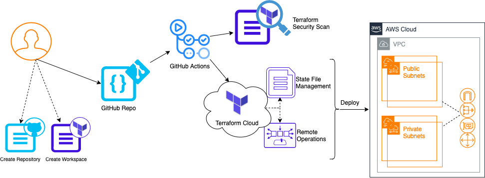

Here's a summary:
* You will establish a GitHub repository and Terraform Cloud Workspace to store your code and remotely execute jobs via automation with Terraform
* A GitHub Actions configuration file will carry out the workflow you will define including:
  * Security IN the Pipeline concepts such as Terraform code scanning
  * Remote operations such as resource planning and deployment

# Pre-Reqs

In this section, we'll ensure you have all the necessary tools and services ready to get started.

## Service Providers

**Quick Tip #1:** Check out [this portion](https://youtu.be/aNzzsinCUqo?t=107) of our intro video to follow along the steps needed to setup GitHub and Terraform Cloud as laid out below!

### GitHub

For this Dojo you will need your own [GitHub account](https://github.com) and a [personal access token](https://docs.github.com/en/github/authenticating-to-github/creating-a-personal-access-token) handy to automate a few tasks. You will also need to [create a GitHub organization](https://docs.github.com/en/github/setting-up-and-managing-organizations-and-teams/creating-a-new-organization-from-scratch) where you will be creating your repo for the Dojo. Why the organization you ask? Well since this Dojo is very much in the spirit of *automating all the things*, you will be using Terraform to create the repo itself! To do so, you will define the repo within an organization as the Terraform provider for GitHub doesn't support personal accounts/repositories at the time of writing (see [here](https://github.com/terraform-providers/terraform-provider-github/issues/45#issuecomment-685794673) for details).

**Quick Tip #2:** Be sure to select the following scopes when creating your personal access token:
* repo
* admin:org
* delete_repo

### Terraform Cloud

You will also need your own Terraform Cloud account. This will keep state and run Terraform securely and remotely. [Create an account](https://app.terraform.io/signup/account?utm_source=docs_banner) if you don't already have one, then [generate a User API token](https://www.terraform.io/docs/cloud/users-teams-organizations/users.html#api-tokens). We'll need that as well to automate tasks.

### Amazon Web Services (AWS)

**Quick Tip #3:** The rest of the pre-reqs below can only be performed during the event!

To access the AWS Console, head over to the [AWS Sign-In page](https://devops-dojo.signin.aws.amazon.com/console). Your **IAM user name** will be teamX, where X is the number of your team (e.g. team1, team2, team3 etc). The password will be provided to you by one of the organizers. Once you log in, **make sure you are in the N. Virginia region**, otherwise you will get access denied for any service you try to use.

#### Accessing your Cloud9 Environment

We've set up a [Cloud9 environment](https://aws.amazon.com/cloud9/) for you. If you haven't heard of Cloud9 yet, it's an AWS solution for teams to write and debug code together just with a web browser (it's basically an IDE which you can access through the AWS Console, everyone sees in real time all the code changes being made and you also have access to a terminal).
After you've logged in to AWS, click on **Services** at the top and type in `Cloud9`. That will take you to the Cloud9 console. You should see your team's environment (team1 has been used as example only):


Click on **Open IDE**. This will be your workspace for this Dojo (you don't need to write code in your local computer, but if you want to develop locally and copy and paste to Cloud9, that is totally fine).

#### Disable Temporary Credentials (Required)

Later on in the challenge you will need to obtain an Access Key and a Secret Access Key using the AWS CLI. To do that, you will need to disable AWS-managed temporary credentials in Cloud9. Follow the steps below:

Click on the Cloud9 logo:


Then Preferences:

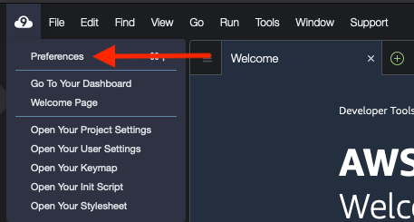

Scroll down until you find the AWS Settings:

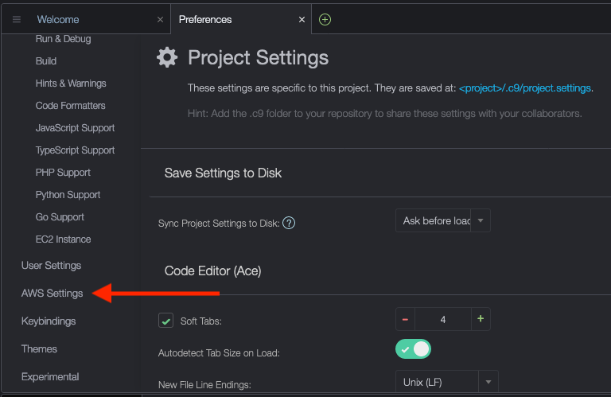

Then make sure it's disabled (you should see the switch go red with an X on the right-hand side):

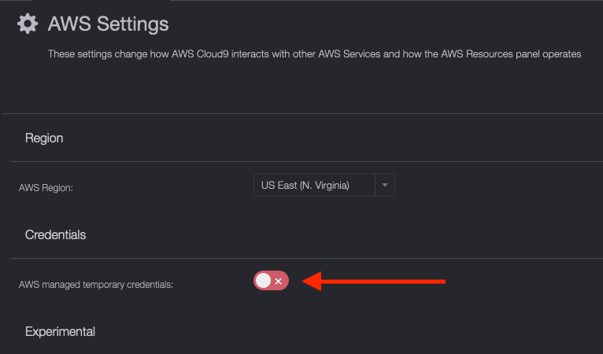

#### Enable Auto-Save (optional)

To configure Cloud9 to save files automatically, do the following:

Click on the Cloud9 icon on the top-left corner and then on Preferences:

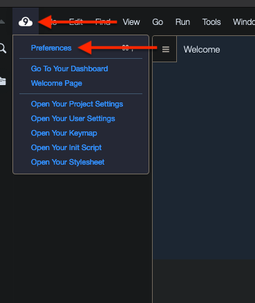

At the bottom, click on Experimental:


Finally, click on drop down and then on `After Delay`, which will cause files to be saved after a second or so:


## Install Terraform and jq

Since your Cloud9 environment does not have Terraform installed, you will have to install it yourself. Run the commands below:

```bash
wget https://releases.hashicorp.com/terraform/0.13.4/terraform_0.13.4_linux_amd64.zip
unzip terraform_0.13.4_linux_amd64.zip
sudo mv terraform /usr/bin/
```

Later on in the challenge you will also need [jq](https://stedolan.github.io/jq/). Run:

```bash
sudo yum install -y jq
```

At this point you are ready to start the challenge in the next section. Good luck, and remember to have fun!

## Get the Code Templates

You can find the pre-req templates in this repo's `boostrap` directory. Go ahead and [clone](https://github.com/git-guides/git-clone) it to get a copy. We'll also clean up the existing git configuration and perform a fresh [initialization](https://github.com/git-guides/git-init) to make it your own!

1. Open a terminal and switch to a directory to work in for the Dojo
1. Clone this repo: `git clone https://github.com/thedojoseries/gitops.git`
1. Navigate to the directory containing the cloned repo
1. Remove the existing git configuration by deleting `.git` directory: `rm -rf .git`
1. Perform a fresh initialization: `git init`
1. Open your IDE

# Building the Solution

## Repository for your code (Stage 1)

The first step will be to deploy a Github repository. This will be used to iterate on the challenge, and build out your automated deployment.

### Prepare files
Open the file `bootstrap/github/main.tf`. You should see the following content:

```hcl-terraform
provider "github" {
  token        = var.github_token
  organization = "<MY-GH-ORG-NAME>"
}

resource "github_repository" "gitops-tf-dojo" {
  name             = "gitops-tf-dojo"
  description      = "DevOps Dojo on Continuous Integration with GitHub Actions and HashiCorp Terraform"
  visibility       = "private"
  has_projects     = false
  has_wiki         = false
  has_downloads    = false
  topics           = ["example", "devops-dojo", "ci", "continuous-integration", "terraform", "tfc", "terraform-cloud", "github", "github-actions", "gitops"]
}

resource "github_actions_secret" "tfc_token" {
  repository      = github_repository.gitops-tf-dojo.name
  secret_name     = "TF_API_TOKEN"
  plaintext_value = var.tfc_token
}
```

There are a few things happening here. This will create a new repository and secret in your GitHub Organization. The *encrypted secret* will contain the Terraform Cloud (TFC) API token we will specify in the pipeline stages (aka the Actions Stages). More on this later.

Go ahead and replace `<MY-GH-ORG-NAME>` in this section with the name of your GitHub Organization.

Next, create a new file in this directory and name it `secrets.auto.tfvars`. This file will contain sensitive values such as your GitHub User token, and Terraform Cloud API token. These values will be passed into the template at runtime when we have Terraform plan and run the deployment.

Go ahead and populate these values that you noted from the Pre-Req section above. The file should be formatted as follows:

```hcl-terraform
github_token = "<MY-GH-TOKEN>"
tfc_token    = "<MY-TFC-TOKEN>"
```

**NOTE:** A file like this should *never* be checked into a Version Control System (VCS) such as Git, due to its sensitivity and so you'll notice there's an entry in the `.gitignore` file for good measure.

### Create repository
At this point we're ready to have Terraform create our repository.

First we have to tell Terraform to [initialize](https://www.terraform.io/docs/commands/init.html) by running the following command:

`terraform init`

**PS: If you got back `bash: terraform: command not found`, [make sure you install Terraform in your Cloud9 environment](#install-terraform).**

You will see some output and toward the end you should see:

`Terraform has been successfully initialized!`

Next, we'll run a Terraform [plan](https://www.terraform.io/docs/commands/plan.html) command: `terraform plan`

Expected output:

```commandline
An execution plan has been generated and is shown below.
Resource actions are indicated with the following symbols:
  + create

Terraform will perform the following actions:

  # github_actions_secret.tfc_token will be created
  + resource "github_actions_secret" "tfc_token" {
      + created_at      = (known after apply)
      + id              = (known after apply)
      + plaintext_value = (sensitive value)
      + repository      = "gitops-tf-dojo"
      + secret_name     = "TF_API_TOKEN"
      + updated_at      = (known after apply)
    }

  # github_repository.gitops-tf-dojo will be created
  + resource "github_repository" "gitops-tf-dojo" {
      + allow_merge_commit     = true
      + allow_rebase_merge     = true
      + allow_squash_merge     = true
      + archived               = false
      + default_branch         = (known after apply)
      + delete_branch_on_merge = false
      + description            = "DevOps Dojo on Continuous Integration with GitHub Actions and HashiCorp Terraform"
      + etag                   = (known after apply)
      + full_name              = (known after apply)
      + git_clone_url          = (known after apply)
      + has_downloads          = false
      + has_projects           = false
      + has_wiki               = false
      + html_url               = (known after apply)
      + http_clone_url         = (known after apply)
      + id                     = (known after apply)
      + name                   = "gitops-tf-dojo"
      + node_id                = (known after apply)
      + private                = (known after apply)
      + ssh_clone_url          = (known after apply)
      + svn_url                = (known after apply)
      + topics                 = [
          + "ci",
          + "continuous-integration",
          + "devops-dojo",
          + "example",
          + "github",
          + "github-actions",
          + "gitops",
          + "terraform",
          + "terraform-cloud",
          + "tfc",
        ]
      + visibility             = "private"
    }

Plan: 2 to add, 0 to change, 0 to destroy.

------------------------------------------------------------------------

Note: You didn't specify an "-out" parameter to save this plan, so Terraform
can't guarantee that exactly these actions will be performed if
"terraform apply" is subsequently run.
```

Notice the line `plaintext_value = (sensitive value)`... this is great, Terraform is keeping the value out of the output in case this is getting logged. Anyway looks good, let's deploy!

Now let's kick off the Terraform [apply](https://www.terraform.io/docs/commands/apply.html) command: `terraform apply`

You will notice that Terraform executes another plan and provides the same summary followed by a prompt to confirm. Type `yes` and press enter.

Expected output:

```commandline
github_repository.gitops-tf-dojo: Creating...
github_repository.gitops-tf-dojo: Creation complete after 9s [id=gitops-tf-dojo]
github_actions_secret.tfc_token: Creating...
github_actions_secret.tfc_token: Creation complete after 2s [id=gitops-tf-dojo:TF_API_TOKEN]

Apply complete! Resources: 2 added, 0 changed, 0 destroyed.

Outputs:

http_clone_url = https://github.com/devopsjakedojo/gitops-tf-dojo.git
```

Finally, copy the repository URL from the output above and add it to your git workspace:

```git remote add origin <MY-GIT-REPO-URL>```

### For Discussion

1. Why do we need to specify the GitHub User token?
1. What's the purpose of including `auto` in the filename `secrets.auto.tfvars`?

### Definition of Done

To make sure everything has deployed correctly, head over to the GitHub console and check if your repository has been created successfully under the Organization you specified. Ensure the secret `TF_API_TOKEN` was created as well.


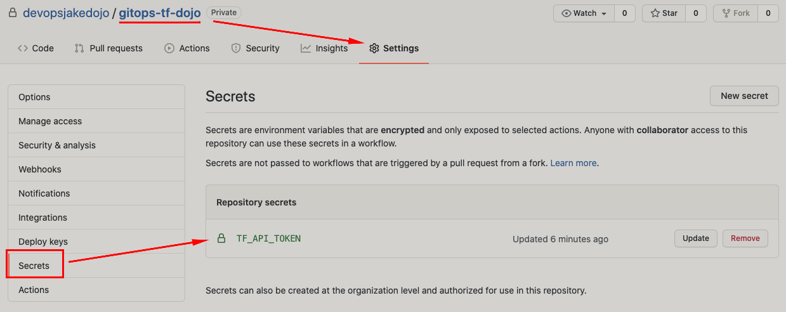

## Workspace for Terraform (Stage 2)

Our next step is to establish a Terraform Cloud Workspace to *contain all things Terraform*... in this case to store [state](https://www.terraform.io/docs/cloud/workspaces/state.html), and execute Terraform operations [remotely](https://www.terraform.io/docs/cloud/run/index.html) for the repository we established in the previous step.

### Prepare files
Open the file `bootstrap/tfc/main.tf`. You should see the following content:

```hcl-terraform
provider "tfe" {}

module "workspace" {
  source  = "DevOpsJake/workspace/tfc"
  version = "0.0.4"

  name         = "gitops-tf-dojo"
  organization = "<MY-TFC-ORG-NAME>"

  variables = var.variables
}
```

In this file we are specifying `tfe` as our provider, which is short for Terraform Enterprise. You will notice reference to this throughout as Terraform Cloud is the SaaS version of Enterprise (aka Self Hosted). I'll refer to Terraform Cloud as TFC from here in since I love to shorten character counts :)

We are also making use of a [Terraform module](https://learn.hashicorp.com/tutorials/terraform/module) here from the [Terraform Registry](https://registry.terraform.io/), instead of writing the code from scratch. There are many great modules available for anyone to use, or you can roll your own as I've done with [this one](https://registry.terraform.io/modules/DevOpsJake/workspace/tfc), but I digress!

When you setup TFC in the pre-reqs section you had to create an Organization as well, similar to GitHub. Go ahead and replace `<MY-TFC-ORG-NAME>` in this section with the name of your org.

Next, create a new file in this directory and name it `secrets.auto.tfvars`. Same deal here as the previous section, but here we are specifying AWS access and secrets keys for your TFC Workspace to store in order for it to be able to deploy our resources to our AWS cloud account.

The file should be formatted as follows:

```hcl-terraform
variables = {
  env_vars_sensitive = {
    AWS_ACCESS_KEY_ID     = "<MY-ACCESS-KEY>"
    AWS_SECRET_ACCESS_KEY = "<MY-SECRET-KEY>"
    AWS_SESSION_TOKEN     = "<MY-SESSION-TOKEN>"
  }
}
```

*Hey so it's possible to pass nested variables?! Cool!*

To obtain an **Access Key ID**, **Secret Access Key** and **Session Token**, you will need to assume a role that has been created for your TFC workspace. Run the following command in your Cloud9 terminal, replacing teamX with the name of your team (i.e. team1, team2, team3 etc):

```
aws sts assume-role \
  --role-arn arn:aws:iam::$(aws sts get-caller-identity | jq -r .Account):role/teamX-tfc \
  --role-session-name "TFCSession" --duration-second 14400
```

You should get the following output:

```json
{
    "Credentials": {
        "AccessKeyId": "[Access Key]",
        "SecretAccessKey": "[Secret Access Key]",
        "SessionToken": "[Session Token]",
        "Expiration": "[Expiration Date]"
    },
    ...
}
```

Finally, in order for Terraform to make API calls to Terraform Cloud (when using the `tfe` provider), you will need to `export` an environment variable called `TFE_TOKEN`. The value of this variable should be the TFC User API token you [generated earlier](#terraform-cloud).

### Create workspace
At this point we're ready to have Terraform create our workspace... Terraform the Terraform! :D

First we have to perform a fresh `terraform init` here, similar to the previous section. Go ahead and run it.

Once again you will see some output and toward the end you should see:

`Terraform has been successfully initialized!`

Next, we'll go straight to a `terraform apply` which will yield a plan for review anyway, and move things along, so we can wrap up bootstrapping!

Expected output:

```commandline
An execution plan has been generated and is shown below.
Resource actions are indicated with the following symbols:
  + create

Terraform will perform the following actions:

  # module.workspace.tfe_variable.env_vars_sensitive["AWS_ACCESS_KEY_ID"] will be created
  + resource "tfe_variable" "env_vars_sensitive" {
      + category     = "env"
      + hcl          = false
      + id           = (known after apply)
      + key          = "AWS_ACCESS_KEY_ID"
      + sensitive    = true
      + value        = (sensitive value)
      + workspace_id = (known after apply)
    }

  # module.workspace.tfe_variable.env_vars_sensitive["AWS_SECRET_ACCESS_KEY"] will be created
  + resource "tfe_variable" "env_vars_sensitive" {
      + category     = "env"
      + hcl          = false
      + id           = (known after apply)
      + key          = "AWS_SECRET_ACCESS_KEY"
      + sensitive    = true
      + value        = (sensitive value)
      + workspace_id = (known after apply)
    }

  # module.workspace.tfe_variable.env_vars_sensitive["AWS_SESSION_TOKEN"] will be created
  + resource "tfe_variable" "env_vars_sensitive" {
      + category     = "env"
      + hcl          = false
      + id           = (known after apply)
      + key          = "AWS_SESSION_TOKEN"
      + sensitive    = true
      + value        = (sensitive value)
      + workspace_id = (known after apply)
    }

  # module.workspace.tfe_workspace.workspace will be created
  + resource "tfe_workspace" "workspace" {
      + auto_apply            = false
      + external_id           = (known after apply)
      + file_triggers_enabled = true
      + id                    = (known after apply)
      + name                  = "gitops-tf-dojo"
      + operations            = true
      + organization          = "<your-organization>"
      + queue_all_runs        = true
      + speculative_enabled   = true
      + terraform_version     = (known after apply)
    }

Plan: 4 to add, 0 to change, 0 to destroy.

Changes to Outputs:
  + tfc_id = (known after apply)

Do you want to perform these actions?
  Terraform will perform the actions described above.
  Only 'yes' will be accepted to approve.

  Enter a value:
```

We see 4 resources to be added: the workspace and three *sensitive* environment variables. Go ahead and type `yes` followed by enter if yours looks good as well.

Expected output:

```commandline
module.workspace.tfe_workspace.workspace: Creating...
module.workspace.tfe_workspace.workspace: Creation complete after 0s [id=ws-63XXrk8DqxUYaVq3]
module.workspace.tfe_variable.env_vars_sensitive["AWS_SECRET_ACCESS_KEY"]: Creating...
module.workspace.tfe_variable.env_vars_sensitive["AWS_ACCESS_KEY_ID"]: Creating...
module.workspace.tfe_variable.env_vars_sensitive["AWS_SESSION_TOKEN"]: Creating...
module.workspace.tfe_variable.env_vars_sensitive["AWS_ACCESS_KEY_ID"]: Creation complete after 0s [id=var-UvKDVQuWFT9gshEf]
module.workspace.tfe_variable.env_vars_sensitive["AWS_SESSION_TOKEN"]: Creation complete after 0s [id=var-fBVGiqp5yH5kzcHc]
module.workspace.tfe_variable.env_vars_sensitive["AWS_SECRET_ACCESS_KEY"]: Creation complete after 0s [id=var-PavTUb4dm8rpgAeh]

Apply complete! Resources: 4 added, 0 changed, 0 destroyed.

Outputs:

tfc_id = [tfc_id]
```

These AWS credentials expire after 1 hour. If you run into errors later on saying that the session expired or if Terraform Cloud is stuck when planning changes, you will need to:

* Run the [STS command again](#prepare-files-1) to obtain new credentials
* Copy the credentials and paste them in the `secrets.auto.tfvars` file
* Plan and apply the changes

 ### For Discussion

 What might be the benefits of using TFC to store state and execute operations remotely?

 ### Definition of Done

 To make sure everything has deployed correctly, head over to the [TFC console](https://app.terraform.io/app/organizations) and check if your workspace and environment variables have been created successfully.

 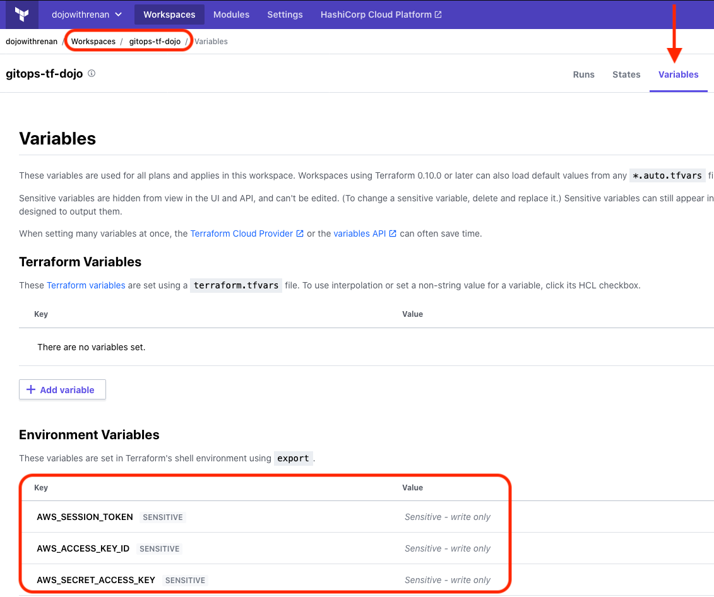

## Create Terraform Configuration (Stage 3)

Now that we have a GitHub repository and TFC workspace created, we are ready to write our first bit of Terraform configuration to work toward getting some infrastructure in AWS deployed. Once again, instead of writing all the configuration from scratch, we'll make use of a module from the [Terraform Registry](https://registry.terraform.io/).

To create this configuration, you will use the [Hashicorp Configuration Language](https://github.com/hashicorp/hcl) (or HCL for short) to define a [Provider](https://www.terraform.io/docs/providers/type/major-index.html), [Backend](https://www.terraform.io/docs/backends/index.html) and a [Module](https://www.terraform.io/docs/modules/composition.html) for reusability, among a number of [other great reasons](https://learn.hashicorp.com/tutorials/terraform/module) to use modules.

The first step will be to establish the configuration files. In your IDE, create a set of barebones files at the root level of your repository directory:

`touch main.tf variables.tf terraform.auto.tfvars outputs.tf`

Next you will edit the files created above and define them using the criteria below. Use the following samples for each file and fill in your own unique values as needed:

### `main.tf` file

```hcl-terraform
provider "aws" {
  region = var.aws_region
}

terraform {
  backend "remote" {
    hostname     = "app.terraform.io"
    organization = "<MY-TFC-ORG-NAME>"

    workspaces {
      name = "<MY-TFC-WORKSPACE-NAME>"
    }
  }
}

module "vpc" {
  source = "terraform-aws-modules/vpc/aws"

  name = var.namespace
  cidr = var.cidr

  azs             = var.azs
  private_subnets = var.private_subnets
  public_subnets  = var.public_subnets

  enable_nat_gateway = true
  single_nat_gateway = true

  tags = {
    Terraform   = "true"
    Environment = var.environment
  }
}
```

### `variables.tf` file

We'll define variables to make things dynamic. Nothing to change here, just copy/paste:

```hcl-terraform
variable "aws_region" {
  description = "The AWS region for resources to be deployed."
}

variable "namespace" {
  description = "Namespace for this deployment. This applies as a prefix to all resources."
}

variable "environment" {
  description = "The environment type (such as 'dev') for this deployment."
}

variable "cidr" {
  description = "The CIDR block for the VPC."
}

variable "azs" {
  description = "A list of availability zones names or ids in the region"
}

variable "private_subnets" {
  description = "A list of private subnets inside the VPC."
}

variable "public_subnets" {
  description = "A list of public subnets inside the VPC."
}
```

### `terraform.auto.tfvars` file

Copy/paste for the most part here as well, though the `namespace` value should be updated with your team name (i.e. team1, team2, team3 etc):

```hcl-terraform
aws_region      = "ca-central-1"
namespace       = "teamX" # team1 or team2 or team3...
environment     = "dev"
cidr            = "10.0.0.0/16"
azs             = ["ca-central-1a", "ca-central-1b", "ca-central-1d"]
private_subnets = ["10.0.11.0/24", "10.0.12.0/24", "10.0.13.0/24"]
public_subnets  = ["10.0.101.0/24", "10.0.102.0/24", "10.0.103.0/24"]
```

### `outputs.tf` file

```hcl-terraform
# VPC
output "vpc_id" {
  description = "The ID of the VPC"
  value       = module.vpc.vpc_id
}

# CIDR blocks
output "vpc_cidr_block" {
  description = "The CIDR block of the VPC"
  value       = module.vpc.vpc_cidr_block
}

# Subnets
output "private_subnets" {
  description = "List of IDs of private subnets"
  value       = module.vpc.private_subnets
}

output "public_subnets" {
  description = "List of IDs of public subnets"
  value       = module.vpc.public_subnets
}

# NAT gateways
output "nat_public_ips" {
  description = "List of public Elastic IPs created for AWS NAT Gateway"
  value       = module.vpc.nat_public_ips
}

# AZs
output "azs" {
  description = "A list of availability zones specified as argument to this module"
  value       = module.vpc.azs
}
```

Before you initialize Terraform, you will need to create a credentials file so that Terraform can authenticate with Terraform Cloud. Creating this file is super easy. Run `terraform login`:

```
$ terraform login

Terraform will request an API token for app.terraform.io using your browser.

If login is successful, Terraform will store the token in plain text in
the following file for use by subsequent commands:
    /home/ec2-user/.terraform.d/credentials.tfrc.json

Do you want to proceed?
  Only 'yes' will be accepted to confirm.

  Enter a value:
```

When asked to `Enter a value`, type in `yes`. Next, you will be asked for your User API token:

```
Generate a token using your browser, and copy-paste it into this prompt.

Terraform will store the token in plain text in the following file
for use by subsequent commands:
    /home/ec2-user/.terraform.d/credentials.tfrc.json

Token for app.terraform.io:
  Enter a value:
```

Grab the token and paste it (you won't actually see the token in the terminal after you paste it). Finally, press enter.

Now that the credentials file has been created, you'll perform a `terraform init` and a `terraform plan`.

After running the init you will see some output and, toward the end, you should see:

`Terraform has been successfully initialized!`

After running the plan you will see the typical output we've seen in previous stages. What's slightly different this time is a [speculative plan](https://www.terraform.io/docs/cloud/run/index.html#speculative-plans) is being performed, along with a link to view the plan running in your TFC Workspace. Follow the link and have a look!

### For Discussion

 What's the reason to hardcode the backend section as opposed to making it dynamic like the rest you think?

### Definition of Done


You have successfully completed this stage if the plan ran successfully in the terminal and in your TFC Workspace! You will notice we are not performing an apply as we'll get back to it in an upcoming section after setting up our Actions Workflow in the next stage!

## Create Actions Workflow (Stage 4)

[Actions](https://docs.github.com/en/actions/creating-actions/about-actions) are individual tasks that you can combine to create jobs and customize your workflow. To get you familiar we will write this one from scratch! To create this configuration, you will use the [Workflow syntax](https://docs.github.com/en/actions/reference/workflow-syntax-for-github-actions).

First you will create a new feature branch and then create an Actions workflow file using your IDE:

1. Create a directory called `.github` at the root of your repository. Then create another directory called `workflows` inside `.github`
1. Create a new file within the `workflows` directory above and name it `terraform.yml`

Next you will edit the file created above and define the first few steps, which checks out your repository so your workflow can access it.

PS: To view hidden folders and files in Cloud9, click on the cog icon and select `Show Hidden Files`:

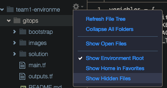

*Hint: Review the syntax reference page linked above to understand how to define the file.*

### Git Checkout Step

* Give this workflow a **name** - `Terraform` is my suggestion
* Workflow should trigger on a **push** to the **master** branch
* Workflow should also trigger on a **pull_request** (without additional configuration)
* Define a job with the ID `terraform`, and name the job `Terraform Actions`
* The job should run on the **latest ubuntu** virtual environment
* Define the first **steps**
    * **name** the first one `Checkout`
    * Which **uses** the latest *checkout v2 action* (refer [here](https://github.com/marketplace/actions/checkout) for details and syntax)

The format of your file should appear as follows (with your own unique values of course):

```yaml
name: <NAME>

on:
  <EVENT>:
    branches:
      - <BRANCH>
  pull_request:

jobs:
  terraform:
    name: <NAME>
    runs-on: <RUNS-ON>
    steps:
      - name: <NAME>
        uses: <USES>
```

### Setup Terraform Step

Define the next step using the GitHub Action [hashicorp-setup-terraform](https://github.com/marketplace/actions/hashicorp-setup-terraform) which sets up Terraform CLI in your workflow:

* **name** it `Setup Terraform`
* Which **uses** `hashicorp/setup-terraform@v1`
    * **with** *cli_config_credentials_token* pointing to the stored GitHub secret `TF_API_TOKEN` established [in a previous stage](#repository-for-your-code-step-1)

### Set up Terraform Init and Format Steps

Now that Terraform CLI has been configured in the workflow in the previous step, we have the ability to specify the next few logical steps needed to successfully execute Terraform operations, such as the `Init` and `Format` commands. We haven't used the format command as yet which is a handy feature that can automatically rewrite your terraform configuration files to a canonical format and style during the development process. However, at this stage where we're creating a workflow for automated deployment we'll use its option to **check** that our files are in the correct format before moving to the next stages (see [here](https://www.terraform.io/docs/commands/fmt.html) for more details on the command).

* Create a new step by the **name** of `Terraform Init` and have it **run** the command `terraform init -input=false`
* Create another step by the **name** of `Terraform Format Check` and have it **run** the command `terraform fmt -check`

Your file should appear now appear as follows:

```yaml
name: 'Terraform'

on:
  <EVENT>:
    branches:
      - <BRANCH>
  pull_request:

jobs:
  terraform:
    name: <NAME>
    runs-on: <RUNS-ON>
    steps:
      - name: Checkout
        uses: <GITHUB-ACTION>

      - name: Setup Terraform
        uses: <GITHUB-ACTION>
        with:
          cli_config_credentials_token: <GITHUB-SECRET-NAME>

      - name: Terraform Init
        run: <TERRAFORM-COMMAND>

      - name: Terraform Format Check
        run: <TERRAFORM-COMMAND>
```

Finally, let's commit all the code you have prepared so far to your new repository and see these initial stages in your workflow in action!

In your terminal, make sure you're at the root level of the repository and run the `git status` command. You should the following untracked files:

```commandline
On branch master

No commits yet

Untracked files:
  (use "git add <file>..." to include in what will be committed)
        .github/
        .gitignore
        README.md
        bootstrap/
        images/
        main.tf
        outputs.tf
        terraform.auto.tfvars
        variables.tf

nothing added to commit but untracked files present (use "git add" to track)
```

First, add all files to the index:

```
git add -A
```

Before you commit, you will need to set up your email and name so Git can use them in the commits. Feel free to use your real email and name, or the email and name provided below:

```
git config --global user.email "johndoe@example.com"
git config --global user.name "John Doe"
```

Now commit and push:

```
git commit -m "Initial commit"
git push -u origin master
```

*Since you're using the HTTPS URL, you will be asked for your GitHub username and password (the one you used to create the GitHub organization).*

After providing your GitHub credentials, you should see the following output (the number of objects might differ slightly):

```commandline
Enumerating objects: 31, done.
Counting objects: 100% (31/31), done.
Delta compression using up to 8 threads
Compressing objects: 100% (29/29), done.
Writing objects: 100% (31/31), 745.76 KiB | 21.31 MiB/s, done.
Total 31 (delta 3), reused 0 (delta 0), pack-reused 0
remote: Resolving deltas: 100% (3/3), done.
To github.com:devopsjakedojo/gitops-tf-dojo.git
 * [new branch]      master -> master
Branch 'master' set up to track remote branch 'master' from 'origin'.
```

### For Discussion

Why do you suppose the option `-input=false` is passed in with the `terraform init` command?

### Definition of Done

Go to the repository in the GitHub Console and ensure it's now populated with your newly committed code. Next, click on the **Actions** tab and see your new workflow in action! Pun intended :)

If the workflow executed without error you will see a checkmark next to your commit message **Initial commit**


Finally, click on **Initial commit** then **Terraform Actions** and expand each step to see additional details.


## Terraform Plan and Apply (Stage 5)

You have made some great progress so far in flushing out an automated workflow which checks out the code, sets up Terraform CLI, initializes and checks the Terraform configuration. Now let's add the Terraform Plan and Apply steps, but first create a new feature branch called `feature/add-tf-plan-apply-steps` and switch to it.

### Terraform Plan Step

* Create a new step below the format step by the **name** of `Terraform Plan`
  * Include an **id** of `plan` (this will come in handy in an upcoming stage)
  * **run** `terraform plan` and choose the appropriate options (if any)

### Terraform Apply Step

This step has some added complexity to ensure the Terraform Apply only occurs under a specific set of circumstances. For this step you will be adding an *if* [conditional](https://docs.github.com/en/free-pro-team@latest/actions/reference/workflow-syntax-for-github-actions#jobsjob_idif) statement based on a few *github* [contexts](https://docs.github.com/en/free-pro-team@latest/actions/reference/context-and-expression-syntax-for-github-actions#contexts). *Hint: You will need a few [operators](https://docs.github.com/en/free-pro-team@latest/actions/reference/context-and-expression-syntax-for-github-actions#operators) to complete the 'if' statement.*

* Create another step below the previous one and **name** it `Terraform Apply` with the following criteria:
    * *Trigger* the step when the PR is merged
    * **run** `terraform apply` and choose the appropriate options (if any)

Once you're done, commit the changes.

### First Pull Request
Finally, we'll kick off a pull request (PR) in order to review the proposed changes to be merged to the master branch, and to see the steps you added to the workflow in action of course! This can be done by using the link conveniently provided in the output of the push you just performed. Look for the portion that appears as follows:

```commandline
remote: Create a pull request for 'feature/add-tf-plan-apply-steps' on GitHub by visiting:
remote:      https://github.com/devopsjakedojo/gitops-tf-dojo/pull/new/feature/add-tf-plan-apply-steps
```

Alternatively, you can also navigate to your GitHub repository using your web browser.

Complete the process by clicking on the **Create pull request** button.

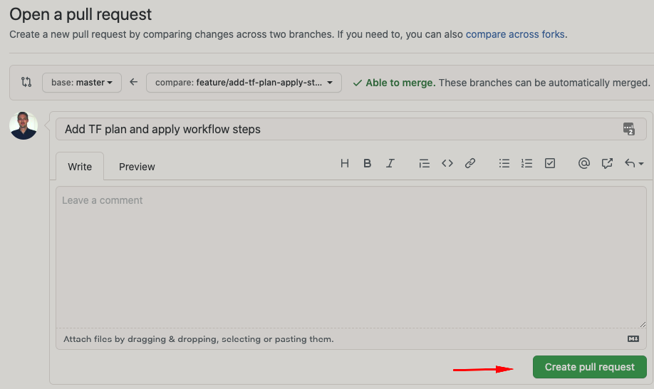

At this point you should see the Open Pull Request summary screen referring to a check that may be running or already completed with a status of *passed* or *failed*. The check is the Terraform workflow you put together. Have a look at the details of the check by clicking on the **Show all checks** link, followed by the **Details** link.


You should now see the new Terraform Plan and Apply steps you added:

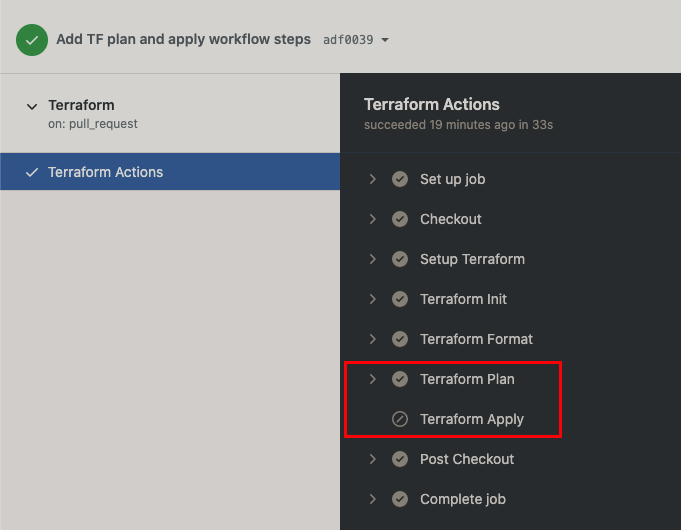

The symbol next to the Terraform Apply step in the image above indicates it didn't run. This is due to the condition you specified in the step that it should only **apply** when merging to the master branch. This allows a reviewer of the PR to inspect the proposed changes Terraform will carry out. This is a great way to ensure the changes are in line with expectations before deploying resources to a live environment.

Go ahead and expand the Terraform Plan step to see review the details.

There's a lot going on here. The plan reports that a new VPC along with a number of related resources including subnets, route tables, as well as internet and NAT gateways will be created, among a few other resources. Good idea to inspect all this before it gets deployed, huh! :)

You should see the following plan summary at the end of the output:

```commandline
Plan: 20 to add, 0 to change, 0 to destroy.
```

If you ran into any issues, such as the *Apply* step actually running after all, or a different result in your plan summary than the one directly above, please call on a Dojo Host for assistance. Otherwise, **press your browser's back button to return to the previous screen** and press the **Merge pull request** button, followed by the **Confirm merge** button. Go ahead press the **Delete branch** button as well to keep your repository tidy.

### For Discussion

Which `terraform apply` option did you use to prevent the pipeline from being stuck?

### Definition of Done

Navigate to the **Actions** tab to see the Terraform Apply in action!


After a short wait it should complete and reveal a successful run (see the checkmark?). Click Merge message link to see the results. You will notice the workflow ran once again, along with the Terraform Apply step this time.

Expand the Terraform Apply step and review it. You should see the following toward the end:

```commandline
Apply complete! Resources: 20 added, 0 changed, 0 destroyed.
```

The `Outputs` section below the message will provide details of the deployed resources. You have successfully completed this section if the apply completed without error. In the Dojo AWS account, go to the VPC console and look around the various sections to see the resources that were deployed.


A few last steps! Switch back to your `master` branch and pull in your newly merged changes to ensure your local code has the most recent changes, and so you're ready to start the next stage on the right foot!

## Security IN the Pipeline (Stage 6)

Security is an important piece to any modern infrastructure and software development lifecycle process, which should be baked-in, as opposed to bolted-on as an afterthought. There are many aspects to employ when it comes to security, for instance the PR process you covered earlier allows another set of eyes to inspect your work before releasing it to the wild.

In this stage you will employ some Security *IN* the Pipeline, an important pillar of DevSecOps! It is a *must have* in any pipeline deployment. To achieve this, you will add a step early in the Actions Workflow to perform automated security testing of your Terraform code:

* Create a new branch (`feature/add-tf-security-scan-step`)
* Open your workflow file (`.github/workflows/terraform.yml`)
* Create a new step between the **Terraform Format** and **Terraform Plan** steps:
    * **name** it `Terraform Security Scan`
    * **use** the [Terraform security scan](https://github.com/marketplace/actions/terraform-security-scan?version=v1.2.2) GitHub Action
      * **NOTE:** Be sure to use version `v1.2.2` (there's currently an issue with previous versions)
    * the step should only be triggered when a Pull Request is created
* Commit, push your changes and open the PR

You will notice the Actions workflow (check) fails once it completes its run. Let's review what happened by clicking on the **Show all checks** link, followed by the **Details** link.

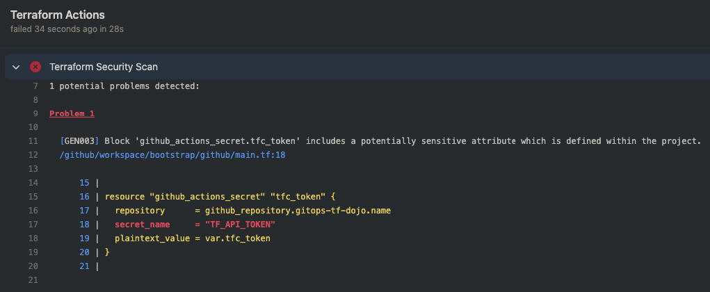

Looks like the scan found a potential issue in the file `bootstrap/github/main.tf` on line 18. It seems the reference to an API TOKEN in that block of code was flagged, otherwise the rest of our code looks good.

This case is a false-positive as you didn't actually expose any sensitive information. Remember, the actual token was in a file that wasn't committed to the repo due to our handy .gitignore entry. In cases like this an exception can be added to avoid these false-positives. Let's do that now:

* Open the file containing the flagged issue noted above
* Append the following to the end of the line that was flagged: `#tfsec:ignore:GEN003`
    * Your line should now look as follows:
    ```
    secret_name     = "TF_API_TOKEN"  #tfsec:ignore:GEN003
    ```

Refer to the tool's [README](https://github.com/liamg/tfsec/blob/master/README.md) for additional details on usage, including a full legend on the various checks it performs.

Now commit and push the change to the repo, and have another look at the details of the check.

### Definition of Done

The Terraform Security Scan step should now be succeeding:

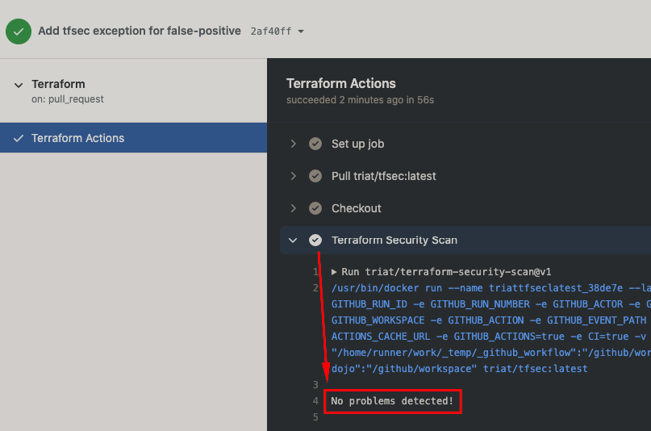

If your check passed as seen in the image above then you have completed this stage successfully!

Return to the **Conversation** tab and click the **Merge pull request** button, followed by the **Confirm merge** button to complete the process. Don't forget to clean up by also clicking the **Delete branch** button!

Like in the previous stage, go ahead and return to the master branch and pull in your latest merged changes

## Cleanup (Stage 7)

*NOTE:* There are a few bonus stages below. Skip this stage for now if you plan to complete those, otherwise carry on here.

In this final stage, you will understand how to clean up deployed resources and the Terraform workspace by using the Destruction and Deletion features included in the TFC console.

Start by navigating to the your workspace in the TFC console, and then by choosing *Destruction and Deletion* in the *Settings* drop-down menu.

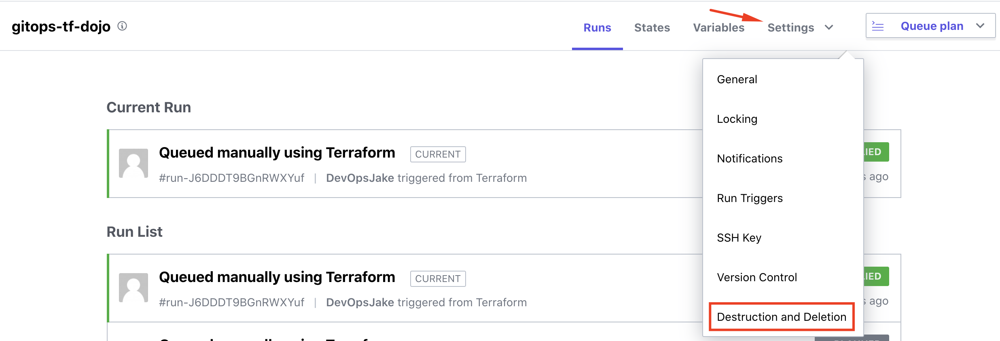

Two different options are presented: Destroy infrastructure and Delete Workspace.

### Destroy infrastructure

The *Queue destroy plan* action does exactly as described; starts a plan to destroy any infrastructure created by prior Terraform Cloud runs. Proceed with caution here! ;)

Go ahead and click the button. You will be presented by a warning screen to confirm the action. Enter the name of your workspace and click the *Queue destroy plan* button to proceed.

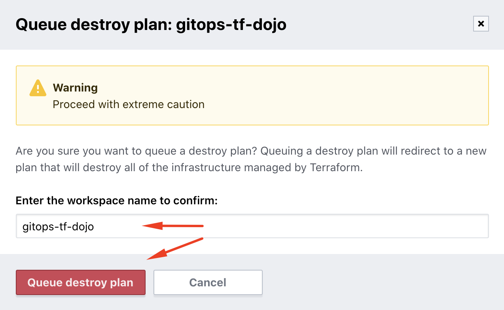

The Plan will run and present you with the results of the resources to be destroyed, requiring confirmation. Review the plan and proceed to click the *Confirm & Apply* button when ready.


Complete the process by providing a comment and clicking the *Confirm Plan* button.

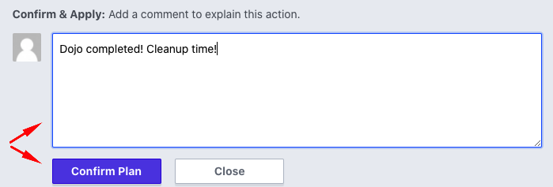

Sit back and watch as the action applies. No heavy lifting required! When the process completes, you will see a successful apply finished.

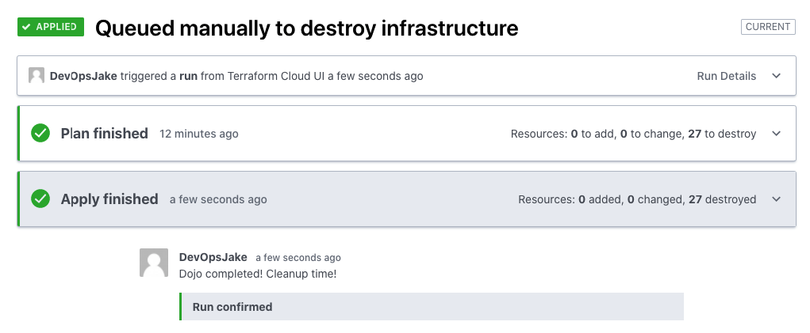

In addition to the steps above, be aware these operations can be performed in the command line as well! To do so in the terminal, make sure you're at the root level of the repository and run the `terraform plan -destroy` command, which is the same as the *Queue destroy plan* action you performed earlier. To move forward and destroy, run the `terraform destroy` command, which functions much like the `terraform apply` in that it will again run a plan on the resources to be destroyed, prompting you to confirm.

There you have it! You are now versed to perform these actions through a GUI (the Terraform Cloud Console), and a terminal (command line)!

### Delete Workspace

The *Delete from Terraform Cloud* action deletes your workspace from Terraform Cloud. This is a final cleanup step if you do not plan to redeploy infrastructure using this workspace.

*Note:* Deleting a workspace does not destroy infrastructure that has been provisioned by that workspace. For example, if you were to delete this workspace now, without performing the steps in above then your infrastructure would remain deployed.

Go ahead and click the button. You will be presented by a warning screen to confirm the action. Enter the name of your workspace and click the *Queue destroy plan* button to proceed.

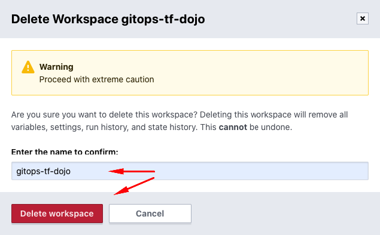

You receive a timed prompt informing you the action is complete and the workspace is no longer visible in the console. All done! Scroll to the bottom for some final words in the Conclusion section.

.

## OPTIONAL BONUS STAGE

### Plan Outputs to Comments (Part 1)

How cool would it be to have the output of the Terraform Plan directly in a PR comment!? This can come in handy to save time during the review process, or to aid in the audit process where it can be easily referenced in the PR log.

Open your `terraform.yml` workflow file once again, add a new step between the **Terraform Plan** and **Terraform Apply** steps, using the following snippet:

```yaml
- name: Create Plan Output Comment
  if: github.event_name == 'pull_request'
  uses: actions/github-script@0.9.0
  env:
    STDOUT: "```${{ steps.plan.outputs.stdout }}```"
  with:
    github-token: ${{ secrets.GITHUB_TOKEN }}
    script: |
      github.issues.createComment({
        issue_number: context.issue.number,
        owner: context.repo.owner,
        repo: context.repo.repo,
        body: process.env.STDOUT
      })
```

Notice the reference to`plan` in the `STDOUT` line above? This is where the `plan` **id** in the Terraform Plan step you created earlier came in handy ;)

This is also the reason `-no-color` was specified in that step as the output would not display correctly in the comment.

### Definition of Done

You will confirm this works as expected in the next stage. While these changes remain uncommitted in your master branch at the moment, they will be carried over when you create a new feature branch in the next stage. You can move on.

### Putting it all together (Part 2)

Now that you have a flushed out working solution, let's see it all in Action by running through all the typical steps an engineer would carry out when adding a new feature. In this section you will use all the knowledge you gained to update the vpc module configuration in order to deploy a new set of intra subnets using the GitOps solution you have built.

Perform the following:

1. Create a new feature branch
1. Update the Terraform files at the root of the repository as needed
    1. Update the module block in `main.tf` to add **intra** subnets (refer to [vendor docs](https://registry.terraform.io/modules/terraform-aws-modules/vpc/) if needed)
    1. Specify 3 subnets using a new variable
    1. Use the following CIDR Ranges:
        1. `10.0.1.0/24`
        1. `10.0.2.0/24`
        1. `10.0.3.0/24`
    1. Output the IDs of the subnets
1. Commit and push the changes of your new branch to the repo
1. Create a PR and step through the paces of the review process
1. Merge to master and monitor the running deployment, you can view two ways:
    1. Actions tab in the repo
    1. Terraform Cloud Console

### For Discussion

How does an intra subnet differ from a private subnet?

### Definition of Done

1. PR checks passed

1. TF Plan Output in PR Comments

...
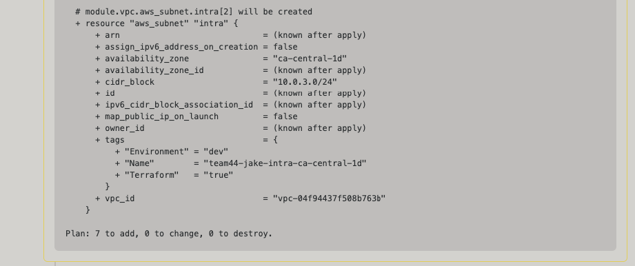
1. PR Merged and TF Applied
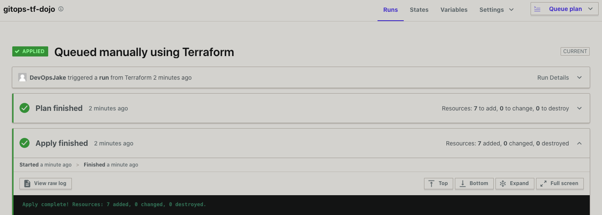
1. Intra Subnet IDs displayed in TF Apply Outputs
    ```hcl
    intra_subnets = [
      "subnet-xxxxxxxxxxxxxxxxx",
      "subnet-yyyyyyyyyyyyyyyyy",
      "subnet-zzzzzzzzzzzzzzzzz",
    ]
    ```
1. New Subnet Deployed


This concludes the bonus stage! You may now return to the final stage above which covers the cleanup of deployed resource and the TFC workspace.

# Conclusion

Congratulations on finishing the challenge! Here's a recap of what you learned:

* Create and configure workspaces in Terraform Cloud
* Connect GitHub Organization's repositories to Terraform Cloud workspaces
* Automate infrastructure deployments to AWS with Terraform and GitHub Actions
* Leverage the Terraform Registry to define infrastructure configurations with reusable modules
* Use a Terraform Security Scanner to implement one of the DevSecOps pillars - Security *IN* the Pipeline!

I hope you had fun doing this challenge. See you in the next DevOps Dojo!
